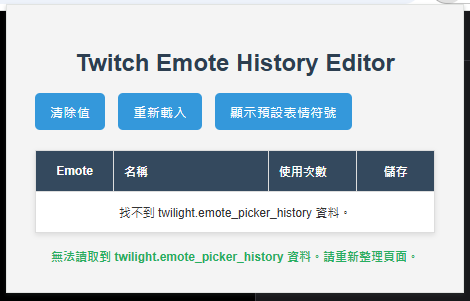
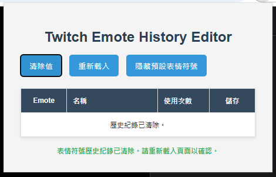
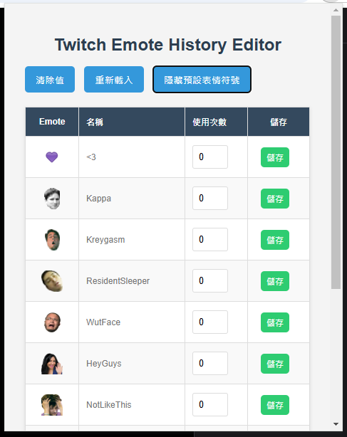

# Twitch Emote History Editor

**Chrome 擴充功能：Twitch 表情符號歷史紀錄編輯器**

 

## 簡介

**Twitch Emote History Editor** 是一個 Chrome 瀏覽器擴充功能，旨在幫助使用者更方便地查看和管理在 Twitch 直播平台上使用的表情符號歷史紀錄。

這個擴充功能會讀取 Twitch 網站儲存在瀏覽器 LocalStorage 中的表情符號使用紀錄，並以表格形式在擴充功能彈出視窗中呈現。  使用者可以輕鬆瀏覽所有使用過的表情符號、其名稱和使用次數，並且可以直接在擴充功能中編輯表情符號的 **使用次數** 值。

## 功能特色

*   **查看表情符號歷史紀錄：**  以清晰的表格形式顯示所有 Twitch 表情符號的歷史紀錄，包括表情符號圖片、名稱和使用次數。
*   **編輯表情符號使用次數：**  直接在表格中編輯每個表情符號的"使用次數"值，並即時儲存。
*   **清除歷史紀錄：**  提供按鈕快速清除所有表情符號的使用歷史紀錄。
*   **重新載入資料：**  提供按鈕重新從 Twitch LocalStorage 載入最新的表情符號歷史紀錄。
*   **顯示/隱藏預設表情符號：**  可以切換顯示或隱藏 Twitch 預設的常見表情符號，方便使用者專注於自訂或特定頻道的表情符號。
*   **依使用次數排序：**  表情符號列表會自動依照 "使用次數" 次數從多到少排序，讓使用者快速找到最常用的表情符號。
*   **簡潔的使用者介面：**  彈出視窗介面設計簡潔直觀，操作容易。
*   **本地端資料儲存：**  所有歷史紀錄資料都儲存在您的瀏覽器 LocalStorage 中，保障個人隱私。

## 安裝步驟

由於此擴充功能目前尚未發布到 Chrome 線上應用商店，您需要以**開發者模式**手動安裝：

1.  **下載程式碼：**  從 GitHub 專案頁面下載程式碼壓縮檔 (ZIP 檔案)，或使用 Git 指令 Clone 專案到您的電腦。
2.  **開啟 Chrome 擴充功能管理頁面：**  在 Chrome/Edge 瀏覽器網址列輸入 `chrome://extensions/` 並按下 Enter 鍵。
3.  **開啟「開發人員模式」：**  在擴充功能管理頁面右上角，將「**開發人員模式**」開關打開 (Edge在左邊)。
4.  **載入未封裝擴充功能：**  點擊左上角的「**載入未封裝項目**」按鈕 (Edge為載入解壓縮)。
5.  **選擇專案資料夾：**  在檔案瀏覽器中，選擇您下載或 Clone 的擴充功能專案資料夾，點擊「**選擇資料夾**」或「**確定**」。

完成以上步驟後，**Twitch Emote History Editor** 擴充功能就會安裝到您的 Chrome 瀏覽器中了。

## 使用方法

1.  **開啟 Twitch 網站：**  在 Chrome 瀏覽器中開啟 [Twitch 網站](https://www.twitch.tv)。

2.  **點擊擴充功能圖示：**  在 Chrome 瀏覽器工具列 (網址列右側) 找到 **Twitch-Frequently-Used-Emotes-Manager** 的擴充功能圖示 (如下圖所示)。

    
    *擴充功能圖示位於 Chrome 工具列*

3.  **開啟彈出視窗：**  點擊擴充功能圖示，即可開啟擴充功能的彈出視窗 (如下圖所示)，第一次點開需重新整理 Twitch 頁面。

    

4.  **查看和編輯歷史紀錄：**  在彈出視窗中，您可以看到表情符號歷史紀錄表格。

5.  **使用按鈕功能：**
    *   **清除值：**  點擊「**清除值**」按鈕，可以清除所有表情符號的歷史紀錄 (如下圖所示) 點完之後請重新整理 Twitch 頁面。

        

    *   **重新載入：**  點擊「**重新載入**」按鈕，可以重新從 Twitch LocalStorage 讀取最新的資料。
    *   **顯示/隱藏 預設表情符號：**  點擊「**顯示預設表情符號**」或「**隱藏預設表情符號**」按鈕，可以切換預設表情符號的顯示狀態。

6.  **編輯 "使用次數" 欄位：**  您可以直接在表格中編輯每個表情符號的 "使用次數" 值 (如下圖所示)。  修改後請點擊「**儲存**」按鈕儲存變更。

    

## 注意事項

*   **資料來源：**  本擴充功能讀取的資料來源為 Twitch 網站儲存在您瀏覽器 LocalStorage 中的 `twilight.emote_picker_history` 紀錄。
*   **重新整理網頁：**  在清除歷史紀錄後，可能需要重新整理 Twitch 網頁才能完全生效。
*   **非官方擴充功能：**  **Twitch Emote History Editor** 是一個非官方的個人專案，與 Twitch 公司沒有任何關聯，也不受 Twitch 官方認可或支援。  使用本擴充功能可能存在風險，請自行評估是否使用。

## 授權條款

[MIT License](LICENSE)  您可以自由使用、修改和散布本專案的程式碼，詳情請參閱 [LICENSE](LICENSE) 檔案。

## 贊助 / Donate

如果您覺得 **Twitch-Frequently-Used-Emotes-Manager** 這個擴充功能對您有幫助，並且願意支持我的開發工作，非常歡迎您透過以下連結贊助我：

*   **歐付寶 (oPay)：** [贊助連結 (歐付寶)](https://payment.opay.tw/Broadcaster/Donate/24F8296772A9D24F2F70E3BB22F5C3E8) - 透過歐付寶平台贊助。
*   **綠界科技 (ECPay)：** [贊助連結 (綠界科技)](https://p.ecpay.com.tw/E1B34) - 透過綠界科技平台贊助。

您的贊助將是對我最大的鼓勵和支持，讓我更有動力持續開發和維護這個專案，提供更好的使用者體驗。非常感謝您的支持！

**歡迎使用 Twitch Emote History Editor！**  

如果您有任何問題、建議或發現 Bug，歡迎提出 Issue 或 Pull Request 或透過 [Discord (darrylych)](https://discord.com/users/536082876836610058) 聯絡我。
